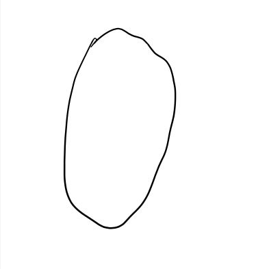
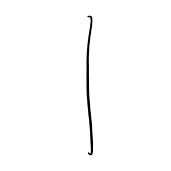
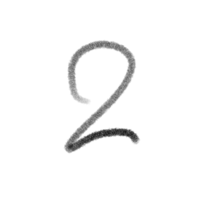
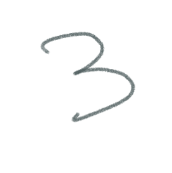
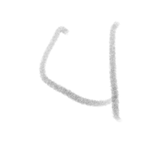
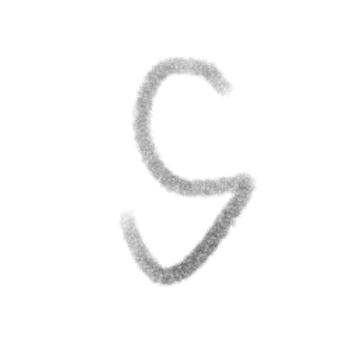
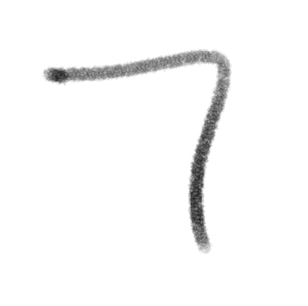
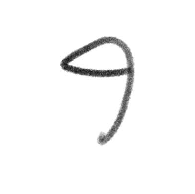

<h1 align = "center"> MSU-NIST </h1>

## CS:3210 Machine Learning Final Project

### Professor: Feng Jiang

#### Team Members:

- **Ling Thang**
- **Joaquin Trujillo**

#### Project Description:

For our Final project we have decided to work on the classic digit recognition problem. Taking a spin on the classic MNSIT dataset we have decided to collect our own dataset from around the Auraria campus housing the three schools MSU Denver, CU Denver, and CCD. We decided to take this approach because we believe that as machine learning students it is not only important to understand not just the application of machine learning but also the data collection, preprocessing, and cleaning that are the core of Machine Learning. We believe that this will give us a better understanding of the process and the challenges that come with it as well as the importance of data quality.

## Data Preprocessing:

- Data preprocessing refers to the transformations applied to our data before feeding it to the algorithm.

- each of the digits are then converted to their own individual images and saved in their respective folders.

    
    
    
    
    
    
    
    
    
    

## Pygames

#### We attempted to create a pygames to utilize our model however we are still experiencing some issues with the accuracy.
